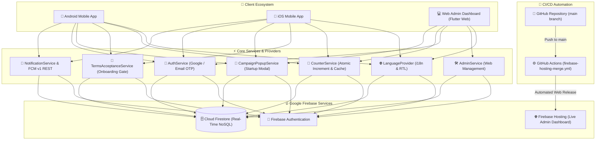

<div align="center">

# 🕌 NOOR E SUNNAT (نورِ سنت)
### *Enterprise-Grade Islamic Knowledge Hub, Global Salawat Counter & Real-Time Cloud Administration Platform*

[](https://flutter.dev)
[](https://dart.dev)
[](https://firebase.google.com)
[](https://firebase.google.com/docs/cloud-messaging)
[](https://islamic-app-ed1ed.web.app)
[](https://play.google.com/store/apps/details?id=com.nooresunnat.islamic_app)
[](https://github.com/Hassan-Developer-cmd/FAIZAN-E-DUROOD/actions)
[](LICENSE)

<br/>

**[🌐 Live Web Admin Portal](https://islamic-app-ed1ed.web.app)** • **[📱 Google Play Store](https://play.google.com/store/apps/details?id=com.nooresunnat.islamic_app)** • **[📦 GitHub Repository](https://github.com/Hassan-Developer-cmd/FAIZAN-E-DUROOD.git)** • **[🐛 Report an Issue](https://github.com/Hassan-Developer-cmd/FAIZAN-E-DUROOD/issues)**

---

</div>

## 📌 Overview

**NOOR E SUNNAT (نورِ سنت)** is a production-ready, cross-platform mobile application and web administrative ecosystem designed to revive sacred Sunnah practices, encourage continuous recitation of Salawat (Durood Sharif) upon the Holy Prophet Muhammad (ﷺ), provide authenticated Fiqh guidance and Islamic Aqaid (Creed), and foster a global spiritual community through verified Islamic events, Q&A, and community campaigns.

Engineered with **Flutter**, **Dart**, and **Google Firebase**, NOOR E SUNNAT pairs a polished mobile experience (Android & iOS) with an enterprise-grade **Web Administration Management Dashboard** deployed live on **Firebase Hosting** with automated **GitHub Actions CI/CD**.

---

## 🌟 Key Features & Systems

### 1. 📿 Real-Time Global & Personal Salawat Engine
- **Atomic Global Aggregation**: Real-time counter synchronization anchored to `global_counter/main` via Firestore atomic `FieldValue.increment` writes, ensuring zero desynchronization between mobile clients and the web administration dashboard.
- **Personal Recitation Tracking**: Tracks daily counts (`myToday`), lifetime recitations (`myTotal`), Durood points, and personal milestone goals (`100`, `300`, `500`, `1,000`, `5,000`).
- **Unified Tap & Quick-Add Pipeline**: Presets (`+100`, `+200`, `+500`, `+1,000`) and manual taps share a single asynchronous debounce/flush pipeline with instant optimistic UI response.
- **Snapchat-Style Daily Streaks**: True calendar-day window tracking that rewards continuous daily engagement with grace periods and automated midnight roll-overs.
- **Dynamic Leaderboard**: Live community rankings query-driven by active streaks and total Salawat recitations.

### 2. 📜 Legal & Compliance Onboarding
- **One-Time Onboarding Modal**: Non-dismissible Terms of Service and Privacy Policy gate blocking app interaction on fresh launches until explicitly accepted.
- **Dual-State Persistence**: Checks local storage (`has_accepted_terms_v1` in `SharedPreferences`) and the Firestore user document (`hasAcceptedTerms: true`, `termsAcceptedAt`).
- **Scholarly Authenticity & Accuracy Clauses**:
  - *Authenticity*: "Our Islamic research team takes Islamic content from authentic Islamic books and sources and has it reviewed by Islamic scholars."
  - *Content Accuracy*: "Despite our efforts, there may be occasional errors in the content, such as text or data mistakes."
- **Bilingual & RTL-Ready**: Supports live toggling between Urdu and English with custom typographic rendering (`Noto Sans Arabic` & `Inter`).

### 3. 📣 Dynamic Campaign & Announcement Popup System
- **Startup Announcement Modal**: Automatically triggered on fresh app launches to broadcast active campaigns, Milad events, and community targets.
- **Remote Cloud Config**: Dual-written to `settings/launch_popup` and `app_popups/launch_popup` with custom titles, descriptions, route targets, and image banners.
- **Session Protection**: Displays once per session to avoid disrupting the user when navigating between bottom navigation tabs.

### 4. 🏛️ Islamic Aqaid (Creed) Knowledge Base
- **Pillars of Faith**: Foundational articles covering *Tauheed*, *Risalat*, *Ishq-e-Rasool*, *Sahaba-e-Kiram*, *Awliya-e-Kiram / Wilayat*, *Ahle Sunnat*, and *Quran-o-Sunnat*.
- **Canonical Proofs**: Fully referenced with Quranic Ayahs, authentic Hadith citations, and classical scholarly consensus.
- **Full-Text Bilingual Search**: Instant search filtering across English and Urdu titles and article bodies.

### 5. 📚 Fiqh Masail (Jurisprudence) Hub
- **Practical Categories**: Covers *Namaz (Prayer)*, *Wuzu (Ablution)*, *Tayamum*, *Roza (Fasting)*, *Zakat (Almsgiving)*, *Hajj & Umrah*, *Nikah (Marriage)*, *Taharat (Purification)*, and *Miras (Inheritance)*.
- **Authoritative Classical Sources**: Referenced from classical Hanafi and Ahl al-Sunnah literature including *Bahar-e-Shariat*, *Fatawa Ridawiyyah*, *Fatawa Alamgiri*, *Sahih al-Bukhari*, and *Sahih Muslim*.
- **Copy & Share**: Single-tap clipboard copying and native system sharing.

### 6. 💬 "Ask the Scholar" Q&A System
- **Private & Public Queries**: Users submit religious inquiries directly through the app.
- **Scholar Workflow**: Inquiries appear in the Web Admin Portal where certified scholars review, draft verified answers, and publish rulings.
- **Status Lifecycle**: Visual tracking badges (`Pending Review`, `Answered`) with push notifications on resolution.

### 7. 📖 Daily Wisdom: Hadith, Quranic Ayat & Daily Topics
- **Multi-Document Historical Archive**: Non-destructive storage allowing browsing through past daily wisdom records.
- **Hadith of the Day**: Arabic Matn, translation, canonical book citation, and authenticity grading.
- **Ayat of the Day**: Quranic Arabic with diacritics, Urdu/English translation, Surah name, and Ayah index.
- **Topic of the Day**: Concise thematic breakdowns with practical takeaways.

### 8. 📅 Islamic Events Calendar
- **Snapping Carousel**: Highlights significant dates in the Islamic Hijri calendar (e.g. Rabi-ul-Awwal, Shab-e-Barat, Laylat-ul-Qadr, Eid-ul-Fitr, Eid-ul-Adha, Gyarween Sharif).
- **Event Metadata**: Dates, significance summaries, locations, and live status badges.

### 9. 🔔 Push Notifications & FCM v1 Service
- **Modern FCM v1 REST Engine**: Uses Google OAuth2 service accounts for server-to-client push notification broadcasts.
- **In-App Notification Center**: Real-time Firestore notification stream with unread badge count, mark-all-as-read, and swipe-to-delete.

### 10. 💻 Comprehensive Web Admin Dashboard
- **Executive Metrics**: Live stats for total registered users, global Durood volume, today's recitations, active campaigns, and pending questions.
- **Dynamic Leaderboard Management**: Real-time user performance metrics and streak monitoring.
- **Registered User Management**: Detailed user profile inspection modal showing avatars, email, join date, streak, and lifetime counts.
- **Content Management Hub (CRUD)**: Complete management for Hadith, Ayat, Daily Topics, Masail, Aqaid, Events, and Announcements.
- **Campaign Popup Manager**: Publish, toggle, and configure the mobile startup announcement dialog directly from the browser.

---

## 🏗️ Architecture & Data Flow



---

## 🗄️ Firestore Database Schema

| Document / Collection | Role & Purpose | Key Attributes |
|---|---|---|
| `global_counter/main` | Single source of truth for global Salawat tallies | `globalTotal` (int), `todayTotal` (int), `date` (YYYY-MM-DD), `lastUpdated` (timestamp) |
| `users/{uid}` | User profiles, streak tracking & metrics | `username`, `email`, `photoUrl`, `myTotal`, `myToday`, `streak`, `duroodPoints`, `hasAcceptedTerms`, `termsAcceptedAt`, `isAdmin` |
| `settings/launch_popup` | Configuration for mobile startup announcement | `isActive` (bool), `titleEnglish`, `titleUrdu`, `detailsEnglish`, `detailsUrdu`, `buttonTextEnglish`, `buttonTextUrdu`, `targetRoute`, `imageUrl` |
| `app_popups/launch_popup` | Secondary collection mirror for universal popup reading | Same schema as `settings/launch_popup` (dual-write sync) |
| `daily_content/{docId}` | Daily Hadith, Ayat, and Topics of the Day | `type` (`hadith` \| `ayat` \| `topic`), `arabic`, `translation_en`, `translation_ur`, `reference`, `title_en`, `title_ur`, `date`, `isActive` |
| `masail/{docId}` | Authenticated Fiqh rulings | `categoryId`, `question_en`, `question_ur`, `answer_en`, `answer_ur`, `references` (array), `createdAt` |
| `aqaid/{docId}` | Core Islamic doctrine and belief articles | `categoryId`, `title_en`, `title_ur`, `content_en`, `content_ur`, `proofs` (array), `imageUrl`, `order` |
| `events/{docId}` | Hijri calendar occasions and gatherings | `title_en`, `title_ur`, `description_en`, `description_ur`, `eventDate`, `location`, `status`, `isFeatured` |
| `questions/{docId}` | User inquiries for the "Ask the Scholar" portal | `userId`, `userName`, `question`, `category`, `status` (`pending` \| `answered`), `answer`, `answeredBy`, `answeredAt` |
| `notifications/{docId}` | System alerts and broadcast notifications | `title_en`, `title_ur`, `body_en`, `body_ur`, `type`, `targetUserId`, `createdAt`, `readBy` (array) |

---

## 🎨 Design System & Branding

NOOR E SUNNAT adheres to a modern, spiritual aesthetic blending deep Islamic emeralds, shimmering gold accents, and clean white card layouts.

| Token Name | Hex Value | Visual Appearance | Application |
|---|---|---|---|
| **Emerald Deep** | `#064E3B` |  Deep Islamic Emerald | App bars, primary banners, dialog headers |
| **Primary Emerald** | `#047857` |  Forest Emerald | Primary CTA buttons, active state indicators |
| **Accent Gold** | `#D4AF37` |  Traditional Gold | Badges, streak icons, milestone rings, borders |
| **Gold Bright** | `#F59E0B` |  Radiant Amber Gold | Glow effects, rating stars, alert highlights |
| **Background Primary** | `#F8FAF9` |  Off-White Light Tint | Main screen scaffold background |
| **Card Surface** | `#FFFFFF` |  Pure White | Elevated cards, modals, sheets, dialog surfaces |
| **Text Primary** | `#0F172A` |  Slate 900 | High-contrast body, titles, and headers |

### Typography
- **Urdu Script**: Handled by **Google Fonts Noto Sans Arabic** with zero letter-spacing (`letterSpacing: 0.0`) and adjusted line-height (`1.2`–`1.5`) to preserve Arabic/Urdu ligatures and prevent ascender/descender clipping.
- **English Script**: Handled by **Google Fonts Inter** for modern legibility.

---

## 📁 Repository Structure

```text
islamic_app/
├── .github/
│   └── workflows/
│       ├── firebase-hosting-merge.yml         # CI/CD: Automated build & deploy to Firebase Hosting on main push
│       └── firebase-hosting-pull-request.yml   # CI/CD: Pull request preview channel deployment
├── android/                                   # Native Android configuration (Kotlin, Gradle, ProGuard)
├── ios/                                       # Native iOS configuration (Runner, Pods)
├── web/                                       # Web shell, PWA manifest, and index.html
├── assets/
│   ├── icons/                                 # Custom SVG and PNG icons (Google, play store, app icons)
│   └── images/                                # High-resolution brand logo & team avatars
├── lib/
│   ├── main.dart                              # Application bootstrap, AuthWrapper, Web gate & MainShell
│   ├── firebase_options.dart                  # Generated multi-platform Firebase configuration
│   ├── core/
│   │   ├── constants/                         # AppColors, AppTheme, AppTypography
│   │   ├── dummy_data/                        # Fallback datasets (mock_masail, mock_aqaid, mock_events)
│   │   ├── localization/                      # AppTranslations (Bilingual Urdu & English dictionaries)
│   │   ├── models/                            # AppUser, CampaignPopupModel, DailyContentModel, EventModel, MasailModel, AqaidModel
│   │   ├── providers/                         # LanguageProvider (locale management, RTL layout)
│   │   ├── services/                          # EmailOtpService
│   │   ├── utils/                             # StreakHelper, IslamicDateHelper, ImageCompressionHelper
│   │   └── widgets/                           # CampaignPopupDialog, TermsAcceptanceDialog, AppExitConfirmationDialog
│   ├── features/
│   │   ├── admin_panel/                       # Web Admin Dashboard & Admin Login screen
│   │   ├── auth/                              # Authentication screen (Email, Password, OTP, Google Sign-In)
│   │   ├── counter/                           # Salawat CounterScreen, Quick-Add presets & Target rings
│   │   ├── events/                            # UpcomingEventsScreen & EventCard widgets
│   │   ├── home/                              # HomeScreen, Daily Wisdom carousel & GamificationBar
│   │   ├── knowledge_hub/                     # MasailGrid, AqaidGrid, QAScreen & Question submission modals
│   │   ├── profile/                           # ProfileScreen, statistics, image upload & settings sheets
│   │   └── splash/                            # Branded animated splash screen
│   └── services/                              # AuthService, CounterService, CampaignPopupService, TermsAcceptanceService, FcmV1Service, NotificationService
├── test/
│   ├── campaign_popup_test.dart               # Unit and widget tests for startup campaign popups
│   ├── terms_acceptance_test.dart             # Unit and widget tests for terms acceptance onboarding
│   ├── web_admin_desync_fix_test.dart         # Comprehensive integration tests for sync, streaks & counters
│   └── widget_test.dart                       # General widget and login localization tests
├── firebase.json                              # Firebase Hosting rules, rewrites, and headers
├── firestore.rules                            # Cloud Firestore production security rules
├── pubspec.yaml                               # Flutter dependencies and asset registrations
└── README.md                                  # Project documentation
```

---

## 🚀 Getting Started

### Prerequisites
Make sure you have the following installed on your machine:
- [Flutter SDK](https://docs.flutter.dev/get-started/install) (`>= 3.22.0`)
- [Dart SDK](https://dart.dev/get-dart) (`>= 3.4.0`)
- [Firebase CLI](https://firebase.google.com/docs/cli) (`npm install -g firebase-tools`)
- [Git](https://git-scm.com/)

---

### 1. Clone the Repository

```bash
git clone https://github.com/Hassan-Developer-cmd/FAIZAN-E-DUROOD.git
cd FAIZAN-E-DUROOD
```

### 2. Install Dependencies

```bash
flutter pub get
```

### 3. Firebase Setup

To connect to your own Firebase environment:

```bash
# Login to Firebase
firebase login

# Configure FlutterFire for all platforms
flutterfire configure --project=YOUR_PROJECT_ID
```

---

### 4. Running the Application

#### Mobile Application (Android / iOS):
```bash
flutter run
```

#### Web Admin Dashboard (Chrome):
```bash
flutter run -d chrome
```

---

## 🧪 Testing & Verification

The project includes an extensive automated test suite covering state management, Firestore synchronization, streak math, and widget rendering:

```bash
# Run all automated tests (185+ tests)
flutter test

# Run static code analysis
flutter analyze
```

---

## 🚢 CI/CD & Deployment

### Automated Deployment via GitHub Actions
Every push to the `main` branch automatically triggers the `.github/workflows/firebase-hosting-merge.yml` workflow:
1. Sets up the Ubuntu build environment with Java 17 and Flutter stable.
2. Resolves dependencies via `flutter pub get`.
3. Compiles the optimized Web production bundle (`flutter build web --release`).
4. Deploys the artifacts directly to **Firebase Hosting Live Channel**.

### Manual Production Web Deployment

```bash
# Compile web release bundle
flutter build web --release

# Deploy to Firebase Hosting
firebase deploy --only hosting
```

---

## 🔒 Security & Data Integrity

- **Strict Document Isolation**: Users can only write to their own profile document (`users/{uid}`).
- **Admin Privilege Verification**: Write permissions on `global_counter/main`, `settings/*`, `daily_content`, `masail`, `aqaid`, and `events` require authenticated admin verification (`is_admin == true`).
- **Atomic Math**: All counter mutations leverage atomic Firestore increments (`FieldValue.increment`), preventing write collisions during high-traffic community recitation events.
- **FCM v1 Service Account Protection**: Push notifications are dispatched using short-lived OAuth2 access tokens generated on-demand via the Google APIs client library.

---

## 🤝 Contributing

We welcome contributions from the community! To contribute:

1. **Fork** the repository: [https://github.com/Hassan-Developer-cmd/FAIZAN-E-DUROOD/fork](https://github.com/Hassan-Developer-cmd/FAIZAN-E-DUROOD/fork)
2. Create your Feature Branch:
   ```bash
   git checkout -b feature/AmazingFeature
   ```
3. Commit your changes:
   ```bash
   git commit -m "feat: add audio recitation player for Daily Hadith"
   ```
4. Push your branch:
   ```bash
   git push origin feature/AmazingFeature
   ```
5. Open a **Pull Request**.

---

## 📄 License

This project is licensed under the **MIT License** - see the [LICENSE](LICENSE) file for details.

---

<div align="center">

**Developed with ❤️ for the Global Ummah**  
*نورِ سنت — May Allah (ﷻ) illuminate our hearts with the light of the Sunnah and grant us abundant Salawat upon the Beloved Prophet Muhammad (ﷺ).*

</div>
