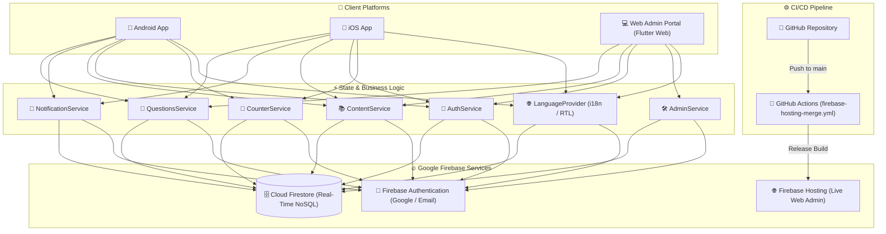

<div align="center">

# 🕌 NOOR E SUNNAT (نورِ سنت)
### *A Production-Grade Islamic Knowledge Hub, Global Salawat Counter & Real-Time Admin Platform*

[](https://flutter.dev)
[](https://dart.dev)
[](https://firebase.google.com)
[](https://firebase.google.com/docs/auth)
[](https://github.com/Hassan-Developer-cmd/FAIZAN-E-DUROOD/actions)
[](https://islamic-app-ed1ed.web.app)
[](https://flutter.dev)
[](LICENSE)

<br/>

**[🌐 Live Web Admin Portal](https://islamic-app-ed1ed.web.app)** • **[📦 GitHub Repository](https://github.com/Hassan-Developer-cmd/FAIZAN-E-DUROOD.git)** • **[🐛 Report Bug](https://github.com/Hassan-Developer-cmd/FAIZAN-E-DUROOD/issues)** • **[✨ Request Feature](https://github.com/Hassan-Developer-cmd/FAIZAN-E-DUROOD/issues)**

---

</div>

## 📌 Executive Summary

**NOOR E SUNNAT (نورِ سنت)** is an enterprise-grade, cross-platform Islamic application and web administrative ecosystem built to revive sacred Sunnah practices, encourage perpetual recitations of Salawat (Durood Sharif) upon the Holy Prophet Muhammad (ﷺ), deliver authentic scholarly Fiqh guidance and Islamic Aqaid (Creed), and connect the global Muslim community through real-time verified Islamic events and Q&A.

Engineered with **Flutter**, **Dart**, and **Google Firebase**, NOOR E SUNNAT combines an intuitive mobile experience for Android and iOS with a dedicated, responsive **Web Administration Management Dashboard** hosted on **Firebase Hosting** with automated **GitHub Actions CI/CD**.

---

## 🌟 Key Features & Modules

### 1. 📿 Global & Personal Salawat (Durood) Engine
- **Live Global Tally**: Synchronized real-time global recitation aggregation powered by Firestore atomic increment transactions.
- **Personal Daily & Lifetime Counters**: Real-time tracking of individual daily counts, lifetime milestones, and ongoing recitation streaks.
- **Daily Target Rings**: Configurable goal milestones (`100`, `300`, `500`, `1,000`, `5,000`) with smooth circular progress animations.
- **Quick-Add & Custom Dialogs**: Instant bulk addition chips (`+10`, `+50`, `+100`, `+500`) alongside a custom numeric input modal.
- **Haptic Tactile Feedback**: Native vibration triggers on every manual tap for an immersive tasbih experience.

### 2. 🏛️ Islamic Aqaid (Creed) Knowledge Base
- **Visual Curated Grid**: Elegant 2-column image cards representing foundational pillars of Islamic belief (*Tauheed*, *Risalat*, *Ishq-e-Rasool*, *Sahaba-e-Kiram*, *Awliya-e-Kiram / Wilayat*, *Ahle Sunnat*, *Quran-o-Sunnat*).
- **In-Depth Article View**: Deep-dive doctrinal explanations backed by authentic Quranic Ayahs, Hadith references, and classical scholarly consensus.
- **Bilingual Real-Time Search**: Instant search filtering across titles, keywords, and body text in English and Urdu.

### 3. 📚 Fiqh Masail (Jurisprudence) Hub
- **Categorized Masail Index**: Exhaustive categorization covering *Namaz (Prayer)*, *Wuzu (Ablution)*, *Tayamum*, *Roza (Fasting)*, *Zakat (Almsgiving)*, *Hajj & Umrah*, *Nikah (Marriage)*, *Taharat (Purification)*, and *Miras (Inheritance)*.
- **Classical Scholarly Authorities**: Every ruling references classical Hanafi and Ahl al-Sunnah literature including *Bahar-e-Shariat*, *Fatawa Ridawiyyah*, *Fatawa Alamgiri*, *Sahih al-Bukhari*, and *Sahih Muslim*.
- **Search & Quick Copy**: Find specific rulings quickly with highlight search matches and one-tap clipboard copy.

### 4. 💬 Interactive "Ask the Scholar" Q&A System
- **Question Submission**: Authenticated users can submit private or public religious queries with topic tags.
- **Scholarly Verification Workflow**: Inquiries are routed to the Web Admin Portal where certified scholars review, answer, and publish rulings.
- **Real-Time Status Tracking**: Dynamic status indicators (`Pending Review`, `Answered`) with in-app notification alerts upon resolution.

### 5. 🌟 Daily Content: Hadith, Quranic Ayat & "Topic of the Day"
- **Historical Multi-Document Architecture**: Non-destructive storage ensuring historical entries are retained for browsing and archive searches.
- **3 Dedicated Daily Wisdom Feeds**:
  - **Hadith**: Arabic Matn, Urdu/English translation, canonical book citation, and classification badge.
  - **Ayat**: Quranic Arabic with diacritics, Urdu/English translation, Surah name, and Ayah index.
  - **Topic of the Day**: Focused thematic study, core takeaways, and authentic scholarly sources.
- **Interactive Home Stepper**: Seamless `< 1 / N >` card stepper with full-screen historical archive sheet and social sharing.

### 6. 📅 Upcoming Islamic Events & Milestones
- **Responsive Carousel**: Snapping horizontal cards highlighting significant dates in the Hijri calendar (Milad-un-Nabi, Shab-e-Barat, Laylat-ul-Qadr, Eid-ul-Fitr, Eid-ul-Adha, Gyarween Sharif).
- **Status Badges**: Visual indicators (`Upcoming`, `Featured`, `Live`, `Completed`).
- **Detailed Event Modal**: Location info, dates, and significance summary.

### 7. 🔔 Notifications & Announcements Center
- **Cloud Notification Stream**: Global and individual notifications stored and delivered via Cloud Firestore.
- **In-App Notification Drawer**: Dynamic badge count, instant read/unread toggles, individual swipe-to-delete, and batch mark-all-as-read.

### 8. 💻 Web Admin Management Dashboard
- **Executive KPI Dashboard**: Live stats for total registered users, global Durood tallies, active events, and pending Q&A items.
- **User Leaderboard**: Real-time community engagement rankings sorted by streak and lifetime Salawat counts.
- **Full Content Management (CRUD)**:
  - Add, edit, archive, and delete Hadith, Ayat, and Topics of the Day.
  - Manage Fiqh Masail, categories, and references.
  - Manage Aqaid articles and image assets.
  - Create and schedule upcoming Islamic events.
  - Review and answer user-submitted Q&A questions.
- **Broadcast Announcements**: Send instant high-priority alerts to all connected app users.

### 9. 🌐 100% Bilingual Localization & RTL Layout
- **Instant Language Switcher**: Switch seamlessly between **English** and **Urdu (اردو)** without reloading.
- **True Bidirectional Rendering**: Full right-to-left (RTL) and left-to-right (LTR) layout switching with customized Urdu typography (`Jameel Noori Nastaleeq` / Google Fonts).
- **Persistent Preferences**: Language selection, dark/light theme tokens, and counter targets are preserved locally via `SharedPreferences`.

---

## 🏗️ Architecture & Data Flow



---

## 🗄️ Firestore Database Schema

The Firestore database utilizes structured collections designed for high-throughput reads, real-time listeners, and atomic counter increments:

| Collection / Path | Purpose | Key Fields |
|---|---|---|
| `counters/global` | Real-time global Salawat aggregator | `total_count` (int), `today_count` (int), `last_updated` (timestamp) |
| `users/{userId}` | User profile & personal stats | `displayName`, `email`, `lifetime_durood`, `today_durood`, `streak_days`, `target_goal`, `is_admin`, `created_at` |
| `daily_content/{docId}` | Daily Hadith, Ayat & Topics | `type` (`hadith` \| `ayat` \| `topic`), `title_en`, `title_ur`, `arabic_text`, `translation_en`, `translation_ur`, `reference`, `date`, `is_active` |
| `masail/{docId}` | Fiqh rulings and guidance | `category_id`, `question_en`, `question_ur`, `answer_en`, `answer_ur`, `references` (array), `created_at` |
| `aqaid/{docId}` | Islamic creed articles | `category_id`, `title_en`, `title_ur`, `content_en`, `content_ur`, `proofs` (array), `image_key`, `order` |
| `events/{docId}` | Community Islamic events | `title_en`, `title_ur`, `description_en`, `description_ur`, `event_date`, `status`, `location`, `is_featured` |
| `questions/{docId}` | User-submitted Q&A | `user_id`, `user_name`, `question`, `category`, `status` (`pending` \| `answered`), `answer`, `answered_by`, `answered_at` |
| `notifications/{docId}` | Broadcasts & user notifications | `title_en`, `title_ur`, `body_en`, `body_ur`, `type`, `target_user_id`, `created_at`, `read_by` (array) |

---

## 📁 Repository Structure

```text
islamic_app/
├── .github/
│   └── workflows/
│       ├── firebase-hosting-merge.yml         # CI/CD: Automated build & deploy to Firebase Hosting
│       └── firebase-hosting-pull-request.yml   # CI/CD: PR preview channel deployment
├── android/                                   # Native Android project files & Gradle scripts
├── ios/                                       # Native iOS project files & CocoaPods configuration
├── web/                                       # Flutter Web shell, index.html & PWA manifest
├── assets/
│   ├── icons/                                 # Custom app and SVG icons
│   └── images/                                # High-res Aqaid category banners (tauheed, risalat, etc.)
├── lib/
│   ├── main.dart                              # Application bootstrap, routing gates & MainShell
│   ├── firebase_options.dart                  # Multi-platform Firebase configuration
│   ├── core/
│   │   ├── constants/                         # AppColors, AppTheme, AppTypography
│   │   ├── dummy_data/                        # Mock fallback datasets (mock_masail, mock_aqaid)
│   │   ├── localization/                      # AppTranslations (English & Urdu dictionaries)
│   │   ├── models/                            # AppUser, MasailModel, AqaidModel, EventModel, DailyContentModel, QuestionModel
│   │   ├── providers/                         # LanguageProvider (locale, RTL & persistence)
│   │   └── utils/                             # Firestore seeder & utility functions
│   ├── features/
│   │   ├── admin_panel/                       # Web Admin Dashboard & Admin Login screens
│   │   ├── auth/                              # Authentication screen (Google & Email/Password)
│   │   ├── counter/                           # Salawat CounterScreen, StatCard & Goal rings
│   │   ├── events/                            # UpcomingEventsScreen & EventCard widgets
│   │   ├── home/                              # HomeScreen, HadithWisdomCard & Quick Actions
│   │   ├── knowledge_hub/                     # MasailGrid, AqaidGrid, QAScreen & Question modals
│   │   ├── profile/                           # User profile, statistics & customization settings
│   │   └── splash/                            # Animated splash screen with brand logo
│   └── services/                              # AuthService, CounterService, ContentService, AdminService, NotificationService, QuestionsService
├── test/
│   └── widget_test.dart                       # Unit and widget test suite
├── firebase.json                              # Firebase Hosting config & cache headers
├── firestore.rules                            # Cloud Firestore security rules
├── pubspec.yaml                               # Project dependencies & asset declarations
└── README.md                                  # Project documentation
```

---

## 🚀 Getting Started

### Prerequisites

Make sure the following tools are installed on your machine:
- [Flutter SDK](https://docs.flutter.dev/get-started/install) (`>= 3.22.0`)
- [Dart SDK](https://dart.dev/get-dart) (`>= 3.4.0`)
- [Firebase CLI](https://firebase.google.com/docs/cli) (`npm install -g firebase-tools`)
- [Git](https://git-scm.com/)

---

### 1. Clone the Repository

```bash
git clone https://github.com/Hassan-Developer-cmd/FAIZAN-E-DUROOD.git
cd FAIZAN-E-DUROOD
```

### 2. Install Dependencies

```bash
flutter pub get
```

### 3. Firebase Configuration

If you want to connect to your own Firebase project:

```bash
# Login to Firebase
firebase login

# Configure FlutterFire
flutterfire configure --project=YOUR_PROJECT_ID
```

---

### 4. Running Locally

#### Run on Mobile (Android Emulator / iOS Simulator / Physical Device):
```bash
flutter run
```

#### Run Web Admin Dashboard in Chrome:
```bash
flutter run -d chrome
```

---

## 🧪 Testing & Quality Assurance

Run the test suite and verify Dart code quality:

```bash
# Run all unit and widget tests
flutter test

# Run static code analysis
flutter analyze
```

---

## 🚢 CI/CD & Deployment

### Automated GitHub Actions Workflow
Every push to the `main` or `master` branch automatically triggers the `.github/workflows/firebase-hosting-merge.yml` workflow:
1. Provisions Ubuntu environment and Java 17.
2. Installs Flutter stable channel with caching.
3. Resolves packages via `flutter pub get`.
4. Compiles the optimized Web release bundle (`flutter build web --release`).
5. Deploys the artifacts directly to **Firebase Hosting live channel**.

### Manual Web Deployment
To build and deploy manually from your development machine:

```bash
# Build production web bundle
flutter build web --release --no-wasm-dry-run

# Deploy to Firebase Hosting
firebase deploy --only hosting
```

---

## 🔒 Security & Firestore Rules

Production Firestore security rules are strictly enforced via [firestore.rules](file:///c:/Islamic%20App/islamic_app/firestore.rules):
- **User Isolation**: Users can only modify their own user document.
- **Admin Privileges**: Write access to `daily_content`, `masail`, `aqaid`, and `events` is strictly gated to verified admin accounts (`request.auth.token.is_admin == true` or `users/{uid}.is_admin == true`).
- **Q&A Moderation**: Users can create questions; only administrators can answer or publish them.
- **Global Rate Limiting**: Increments on global counters are protected against unauthorized bulk alterations.

---

## 🎨 Color Palette & Typography

| Color Token | Hex Code | Purpose |
|---|---|---|
| **Primary Emerald** | `#0F5132` | Main branding, app bars, primary buttons |
| **Accent Gold** | `#D4AF37` | Highlights, badges, achievements, icons |
| **Deep Forest** | `#08331E` | Card gradients, dark headers |
| **Off-White Background** | `#F8FAF9` | Clean, high-contrast readable screen surface |
| **Card Surface** | `#FFFFFF` | Elevated cards, dialogs, sheets |
| **Text Dark** | `#1A2E22` | High-legibility body & header typography |

---

## 🤝 Contributing

Contributions are warmly welcomed! To contribute:

1. **Fork** the repository: [https://github.com/Hassan-Developer-cmd/FAIZAN-E-DUROOD/fork](https://github.com/Hassan-Developer-cmd/FAIZAN-E-DUROOD/fork)
2. Create your Feature Branch:
   ```bash
   git checkout -b feature/AmazingFeature
   ```
3. Commit your changes with descriptive messages:
   ```bash
   git commit -m "feat: implement daily notification reminders"
   ```
4. Push your branch:
   ```bash
   git push origin feature/AmazingFeature
   ```
5. Open a **Pull Request**.

---

## 📄 License

This project is open-sourced under the **MIT License** - see the [LICENSE](LICENSE) file for details.

---

<div align="center">

**Developed with ❤️ for the Global Ummah**  
*نورِ سنت — May Allah (ﷻ) illuminate our hearts with the light of the Sunnah and grant us abundant Salawat upon the Beloved Prophet Muhammad (ﷺ).*

</div>
